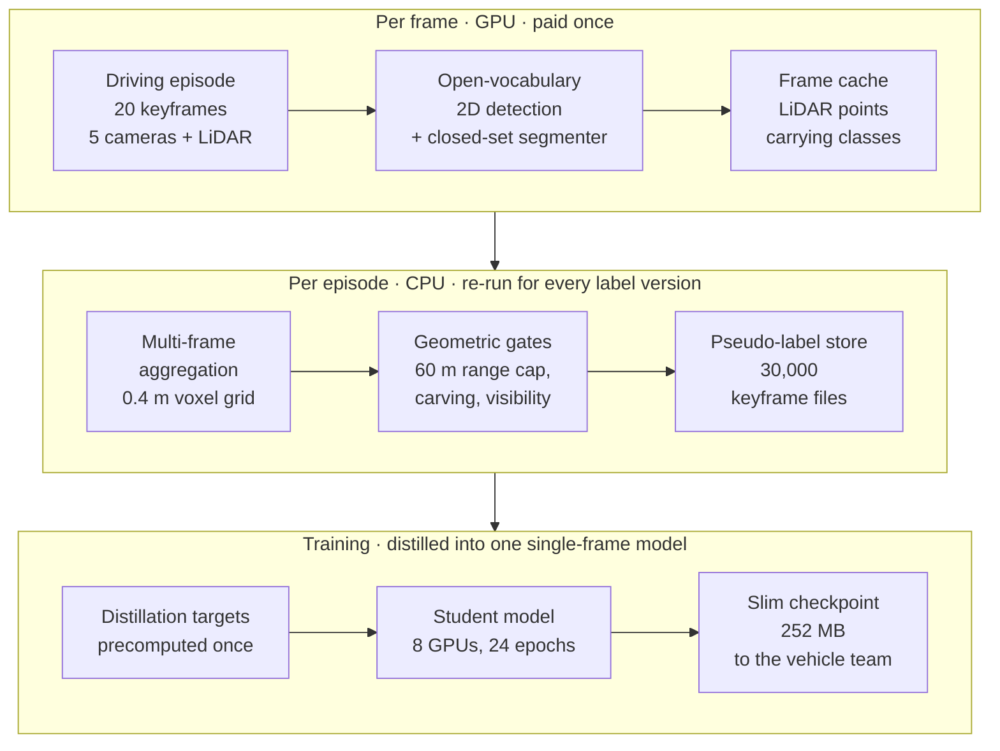

Mercedes-Benz AG needed a 3D occupancy model running on its own recorded driving data, as the
closing demonstrator for its part in [nxtAIM](https://nxtaim.de/en/home/) — a three-year, €27 M
research programme on generative AI methods for automated driving, funded by the German Federal
Ministry for Economic Affairs and Climate Action and run by twenty partners across manufacturers,
suppliers and research institutes. The model existed and was published. What did not exist was
anything to train it on.

A 3D occupancy model predicts, for every cell of a voxel grid around the car, whether that cell is
occupied and by what. On the public benchmark the model was developed against, those labels ship
with the dataset. On the company's own recordings there are none, and nobody can draw them: one
keyframe is a 200 × 200 × 16 grid of 0.4 m voxels, 640,000 cells, and the cells that matter most are
the ones no sensor saw directly, because predicting occluded space is the entire point of an
occupancy model. So the labels had to be generated — and then trusted, with nothing to check them
against.

I built the pipeline that generates them and ran it: 1,500 episodes, each a short recorded drive
sampled at 20 keyframes, 30,000 keyframe label files, produced from LiDAR returns, camera video and
an open-vocabulary 2D detector, with no human annotation anywhere in the chain. The ceiling the team
agreed for labeling and training together was $15,000 of cloud compute, and the work came in at
$7.9–8.3k of it; every dollar on this page is cloud node-hours times a fixed per-node-hour rate, not
an invoice. The first version of the labels came back with a geometric defect that made them
unusable. I traced it to its cause, fixed it with a single rule, rebuilt all 1,500 episodes on 251
machines in 4.6 hours, and delivered the distilled single-frame model to the vehicle team. The model
architecture is published separately ; this page is about everything around it.

| What changed                                  | Before          | After     | How it was measured                                                                                            |
| --------------------------------------------- | --------------- | --------- | -------------------------------------------------------------------------------------------------------------- |
| Cost per labeled episode                      | $4.41           | $2.84     | Whole-campaign node-hours × a fixed per-node-hour rate                                                         |
| Training step time                            | 3.155 s         | 0.958 s   | Per-section timing over 20 recorded steps, batch 2, one 8×A100 node                                            |
| Free-space visibility test, per keyframe      | 161 s           | 8.5 s     | Same frames, method the only change; zero fabricated free voxels, 98.8 % of the exact method's free space kept |
| Share of the grid the training loss can reach | ~31 %           | 77.1 %    | 12-episode sample, weighted by the 700/800 split of the two labeling campaigns                                 |
| Floating "ghost" voxels above the road        | 19,017          | 2,399     | A fixed audit set of 19 episodes and 86 keyframes, scored identically on all four pipeline versions            |
| Whole-project cloud spend                     | $15,000 ceiling | $7.9–8.3k | 1,207 node-hours across 362 cloud jobs, timed from submission to completion, at the same fixed rate            |

**My role.** I designed the pipeline, wrote the aggregation, quality-gate and verification code, ran
every cloud campaign, and made the calls on what to fix and what to ship. The cluster, the episode
store and the open-vocabulary detector were existing infrastructure.

## Generating labels without annotators, and why the budget set the design

Voxel labels cannot be drawn by hand, but they can be assembled. An open-vocabulary 2D detector runs
over the camera images; its classes are painted onto the LiDAR returns, which carry the geometry;
and many frames of one drive are aggregated into a single grid, so a parked car seen from three
angles fills in as one solid object instead of three shells. Countable objects — cars, pedestrians,
poles — come from the open-vocabulary detector, prompted with a short phrase list. Uncountable
background — road, vegetation, building — comes from a closed-set segmenter.

Using a 2D detector as the source of truth has a price: it runs on every camera of every frame, so
cost scales with the corpus while the budget does not. Labeling the entire internal recording
archive, more than twenty-five times the 1,500 episodes that were eventually labeled, would have
taken roughly 78,000 GPU-hours, about $199k at the same fixed rate — some 40× the labeling budget.
Cost was therefore not a matter of tidiness afterwards; it decided the design, and three rules
followed.

The expensive stage gets paid for exactly once, so detector output is cached per frame and every
later label revision is a CPU job. The pipeline has to be verifiable without ground truth, because
there is none. And quality fixes ship behind configuration switches — nine of the ten I eventually
made — so a bad idea can be turned off without re-running anything.



Everything downstream of detection is deterministic and CPU-only, which is what later let a second
version of all 1,500 episodes be built from the cached detections for hundreds of dollars rather
than thousands.

{% include video.liquid path="/assets/img/project_images/occupancy-auto-labeling-pipeline/pseudo-labels-playback.mp4" poster="/assets/img/project_images/occupancy-auto-labeling-pipeline/pseudo-labels-playback-poster.webp" class="img-fluid" controls=true muted=true loop=true autoplay=true caption="Finished pseudo-labels for one episode, played back keyframe by keyframe. Brown is building, green vegetation, blue vehicles, dark grey road, mid-grey occupied space the pipeline could not name. No human drew any of it." %}

The first campaign labeled 700 episodes. Reviewing what came back is where the project actually
began.

## Root-causing the floating voxels: an int16 overflow in the cache, not the model

I reviewed that batch keyframe by keyframe and rejected it. Two defects were repeatable: the fence
class smeared flat across distant ground, and voxels floated above the lane where nothing was —
ghosts, as I will call them from here. At $2.84 an episode, re-running detection to make them go
away was unaffordable, so whatever the fix turned out to be, it had to live in the CPU stage.

Two rounds of plausible fixes — gating 2D-lifted classes by depth, filling detected boxes solid,
carving voxels out along LiDAR rays — cut the ghost count by 72 % and were still rejected on review,
because the worst frames barely moved. An aggregate improvement was hiding a misdiagnosis.

So I stopped guessing and built per-voxel provenance instead. On one rejected keyframe I took every
occupied voxel in the band above the ego lane, and traced each back to the LiDAR point that asserted
it, the source frame that point came from, and its range from that frame's own position. Two things
fell out. The contributing frame index correlated 0.945 with the voxel's forward position, at a
slope of 2.21 m per frame, which at the recording's frame rate is exactly the car's own speed: the
band was a drag trail smeared behind the vehicle, not a structure. And 82 % of those voxels belonged
to a single family whose contributing points sat at exactly 163.835 m from their source frame, with
an interquartile range of zero. That number is not physical. The frame cache stores coordinates as
int16 at a 5 mm step, and 32,767 steps is 163.835 m, so every return past the sensor's real range
was clamped to one distance and then carried into grids where it did not belong.

The fix is one rule instead of five heuristics: a source point may assert occupancy only within 60 m
of its own source frame's position. This is lossless by construction, and the argument is worth
stating because it is what made the rule safe to apply everywhere. Any voxel in a ±40 m grid is at
most √(40² + 40²) ≈ 57 m from that keyframe's car, and the aggregation window sweeps the whole
trajectory, so every real structure inside the grid is seen from within 60 m by some nearby frame.
An observation from further away can only supply a noisier duplicate of one already there. The
result: that keyframe's ghost count fell from 1,451 to 3, and across the audit set the count fell
87.4 % cumulatively while near-range vehicle voxels rose 0.07 %.



```echarts
{"baseOption": {"grid": {"left": 30, "right": 24, "top": 24, "bottom": 8, "containLabel": true}, "tooltip": {"trigger": "axis", "axisPointer": {"type": "shadow"}}, "xAxis": {"type": "category", "data": ["production\nbaseline", "round 1\n5 config-gated fixes", "round 2\n+ geometric carving", "round 3\n+ 60 m source cap"], "axisTick": {"show": false}}, "yAxis": {"type": "value", "name": "ghost voxels", "nameGap": 60, "nameLocation": "middle", "splitLine": {"show": false}}, "series": [{"type": "bar", "name": "out-of-box aerial ghost voxels", "barWidth": "52%", "data": [{"value": 19017, "itemStyle": {"color": "#6e7f88"}, "label": {"formatter": "19,017"}}, {"value": 18726, "itemStyle": {"color": "#6e7f88"}, "label": {"formatter": "18,726"}}, {"value": 5239, "itemStyle": {"color": "#b89278"}, "label": {"formatter": "5,239"}}, {"value": 2399, "itemStyle": {"color": "#b89278"}, "label": {"formatter": "2,399"}}], "label": {"show": true, "position": "top", "distance": 6}}]}, "media": [{"query": {"maxWidth": 600}, "option": {"grid": {"left": 22, "right": 10, "top": 20, "bottom": 8, "containLabel": true}, "yAxis": {"nameGap": 48, "axisLabel": {"fontSize": 10}}, "xAxis": {"axisLabel": {"fontSize": 10}}, "series": [{"label": {"fontSize": 10}}]}}]}
```

Figure 2: the same metric across all four pipeline versions, scored on one fixed audit set so the
four are directly comparable. Round 1's five switchable fixes moved it 1.5 %. Round 2's ray carving
removed a further 72 %, and the frames actually under review still barely changed. Round 3, the
single rule that follows from the root cause, removed another 54 % and took the cumulative fall to
87.4 %. This was measured on the 19-episode audit set, not across all 1,500 episodes.

That 0.07 % rise in near-range vehicle voxels is why the cleanup is defensible at all. "The defect
went away" and "the content survived" are different claims, and a cleanup that only demonstrates the
first is indistinguishable from deletion. Finding the rule took three rounds, and those rounds were
paid for out of the same budget as the labels.

## What labeling cost: $2.84 per episode, and the number I retracted

Cost per episode is the number worth tracking, because it is the only one that survives a change in
corpus size.

```echarts
{"baseOption": {"grid": {"left": 8, "right": 90, "top": 46, "bottom": 34, "containLabel": true}, "tooltip": {"trigger": "axis", "axisPointer": {"type": "shadow"}}, "xAxis": {"type": "value", "name": "USD per episode", "nameGap": 34, "nameLocation": "middle"}, "yAxis": {"type": "category", "data": ["Second label version · CPU only", "Second campaign · 800 episodes", "First campaign · 700 episodes", "Single episode, after the fixes", "First pipeline version"], "axisTick": {"show": false}}, "series": [{"type": "bar", "name": "whole-campaign actual", "data": [], "itemStyle": {"color": "#b89278"}}, {"type": "bar", "name": "probe or CPU-only run", "data": [], "itemStyle": {"color": "#6e7f88"}}, {"type": "bar", "name": "cost per episode", "stack": "cost", "barWidth": "56%", "data": [{"value": 0.59, "itemStyle": {"color": "#6e7f88"}}, {"value": 2.87, "itemStyle": {"color": "#b89278"}}, {"value": 2.84, "itemStyle": {"color": "#b89278"}}, {"value": 1.63, "itemStyle": {"color": "#6e7f88"}}, {"value": 4.41, "itemStyle": {"color": "#6e7f88"}}], "label": {"show": true, "position": "insideRight", "formatter": "${c}", "color": "#14100d", "fontWeight": "bold"}}, {"type": "bar", "name": "upper end of the range", "stack": "cost", "itemStyle": {"color": "#8f8177", "opacity": 0.55}, "data": [{"value": 0.27, "label": {"show": true, "position": "right", "formatter": "up to $0.86"}}, 0.0, 0.0, {"value": 0.36, "label": {"show": true, "position": "right", "formatter": "up to $1.99"}}, 0.0]}], "legend": {"top": 0, "itemGap": 22, "textStyle": {"fontSize": 11}, "data": ["whole-campaign actual", "probe or CPU-only run", "upper end of the range"]}}, "media": [{"query": {"maxWidth": 600}, "option": {"grid": {"left": 8, "right": 54, "top": 66, "bottom": 34, "containLabel": true}, "legend": {"itemGap": 10, "textStyle": {"fontSize": 10}}, "xAxis": {"nameGap": 30, "axisLabel": {"fontSize": 10}}, "yAxis": {"axisLabel": {"fontSize": 10, "width": 96, "overflow": "break"}}, "series": [{}, {}, {"label": {"fontSize": 10}}, {"label": {"fontSize": 9}}]}}]}
```

Figure 3: cost per episode at each measurement point. The bars are not interchangeable. The two
campaign bars include GPU detection and are whole-campaign actuals, so they are the numbers I
planned against; the single-episode figures are probes, cheaper and less representative; and the
second label version was CPU-only re-aggregation from detections already paid for. The two
campaigns, 700 episodes at $2.84 and 800 at $2.87, came to $4,284, and curation, probes, the three
fix rounds, one failed shard and the first re-aggregation added $662–738 — which puts the labeling
half of the budget at $4.95–5.02k against the $5,000 allocated to it, the top of that band $22 over.

One number is missing from that chart because I retracted it. An early concurrency probe reported
$0.473 per episode, a 5.69× improvement on the campaign rate; an audit the same evening showed the
per-episode divisor had counted episodes the job skipped as already done, so the cost was spread
over work that never ran, and real concurrency was two episodes at a time, capped by 16 GB of GPU
memory. The honest single-episode figure is the $1.63–1.99 bar. Retracting it the same evening kept
the budget plan off a number that was not real, and it is worth saying plainly that this is the
number I would most like to have kept.

The ghost fix made the labels correct. It did not make them complete.

## Rebuilding all 1,500 episodes: a 21.6× faster visibility test made it affordable

The first version of the labels supervised about 31 % of the forward half of each grid. The rest was
marked unobserved: it produced no gradient, and left the model free to invent whatever it liked
there. Closing that gap meant deciding, for far more voxels than before, that nothing is there — and
deciding it honestly, because a fabricated empty voxel teaches the model to delete real obstacles.

The rule I needed is strict: mark a voxel free only if an unobstructed line runs from it back to
some LiDAR position along the drive. Written directly that is a ray march from every voxel, 161
seconds per keyframe, which over 30,000 keyframes is a $3,000–4,400 job — more than the labeling
budget had left.

The rewrite is the same question asked from the other end. Instead of marching outward from each
voxel to find out whether anything blocks it, render a depth buffer once from each LiDAR position:
the distance to the nearest return along every direction. A voxel is then free exactly when it lies
closer than that recorded distance in its own direction — one lookup instead of a traversal, and
every voxel in that sensor's view is answered in a single pass. That took the pass from 161 seconds
to 8.5 seconds per keyframe, 21.6× measured locally over 32 LiDAR positions and 19× in a cloud A/B
where nothing but the method changed. Two checks came with it: the fast method fabricates zero free
voxels the exact method would not, and keeps 98.8 % of the free space the exact method finds. That
rewrite is what turned rebuilding the whole corpus into an $887–1,285 job.

It then ran as 251 independent CPU jobs, each owning a slice of the episode list, all submitted
within 27 minutes: 1,500 episodes, 30,000 keyframe files, 4.57 hours wall clock, 251 of 251
finished, no retries. Because each job was idempotent and wrote a done-marker, a failure would have
meant restarting one slice rather than the campaign.


  
  
</img-comparison-slider>

Figure 4: one keyframe, first version left, second version right, bird's-eye view above and a
vertical slice below. Drag the slider: the occupied voxels barely move, and what fills in is free
space in the sensor shadows. Occupied stays at 9.7 % of the forward half-grid across the two
versions; unobserved falls from 59.6 % to 17.9 % and free space rises from 30.7 % to 72.4 %. Across
the two label versions, the share of the grid the training loss can reach went from about 31 % to
77.1 %.

That is one keyframe, flattened. The same episode is below in full: the second label version, all
twenty keyframes, 0.4 m voxels at the resolution the pipeline produces, roughly 65,000 occupied
voxels per keyframe. Drag to turn it, scroll or pinch to zoom, and move the slider to walk the
drive. The labels are decoded in your browser from a 0.9 MB file.



## Checking labels when there is no ground truth

Every number above is a quality claim about data that has nothing to be compared against. That is
the constraint that shaped how the pipeline was verified, and it is worth setting out on its own,
because it is the part that transfers to any project generating its own supervision.

**Split the episode and let the sensor referee.** The free-space rule was accepted on a test that
needs no annotation: build free space from the LiDAR of an episode's first half, then replay the
second half against it. A voxel declared free that later receives a return is a wrong claim, and
those can be counted. Over six episodes, the new rule's false-free rate on the voxels it adds is
0.11 %, against 2.18 % for the forward ray-casting method it replaced. It is worse in exactly one
layer, at roof height, 3.49 % against 2.38 %, which accounts for 0.9 % of the voxels it adds.

**The first version of that test bench was wrong, and in my favour.** An adversarial review found it
omitted the per-frame pose registration that production uses, which moved every number by about an
order of magnitude — always in the new method's favour. The measurements were redone with
registration, and the original table stays in the project record explicitly marked as not citable.
The decision it had supported turned out to be right, which is exactly why the record has to say
that the evidence for it was not.

**Put a guard metric beside every cleanup.** A fix that removes a defect and a fix that deletes
content look identical in the defect count. So each cleanup carries a second measurement chosen to
move if content were lost: near-range vehicle voxels for the ghost fix, which rose 0.07 % while
ghosts fell 87.4 %; the count of fabricated free voxels for the visibility rewrite, which was zero.

**Keep the verification independent of the mechanism.** An earlier round reported a 43.4 %
improvement that turned out to be an artifact of renaming classes — the metric and the fix shared a
mechanism, so the metric could not fail. A check that cannot come out badly is not a check.

**Compare things that were paired, not things that were large.** The audit set is 19 episodes, the
geometry result 11, the checkpoint comparison 9 frames. These are small, and deliberately so: each
is a paired design where the same frames are scored under every condition, so the comparison is
controlled rather than sampled. Ten of the eleven geometry episodes were never part of the 1,500 the
model trained on.

**Keep a human gate at the end.** The first 700-episode batch was rejected on review over a defect
that had no metric yet. The metric was written afterwards, for the defect — which is the order these
things usually arrive in, and a reason not to let the metric set be fixed in advance.

## Cutting the training step 3.3×: a frozen teacher recomputed the same targets every epoch

Training drew on its own budget, and the same rule applied to it: measure before spending. Before
launching a full run I profiled a step. The frozen vision-language teacher that produces the
distillation targets took 2.202 s of 3.155 s, 69.8 % of the step — and it recomputed the same
targets for the same frames on every epoch, because the targets depend only on the input image, not
on the weights being trained.

```echarts
{"baseOption": {"grid": {"left": 8, "right": 24, "top": 86, "bottom": 34, "containLabel": true}, "tooltip": {"trigger": "axis", "axisPointer": {"type": "shadow"}}, "legend": {"top": 0, "itemGap": 16, "itemWidth": 14, "itemHeight": 10, "textStyle": {"fontSize": 11}}, "xAxis": {"type": "value", "name": "seconds per training step", "nameGap": 34, "nameLocation": "middle"}, "yAxis": {"type": "category", "data": ["before  3.155 s", "after  0.958 s"], "axisTick": {"show": false}}, "series": [{"type": "bar", "stack": "step", "name": "frozen teacher, then the cache read that replaced it", "itemStyle": {"color": "#b89278"}, "data": [2.202, 0.0021]}, {"type": "bar", "stack": "step", "name": "backbone + neck", "itemStyle": {"color": "#3f4a50"}, "data": [0.135, 0]}, {"type": "bar", "stack": "step", "name": "tri-perspective encoder", "itemStyle": {"color": "#5b6b73"}, "data": [0.105, 0]}, {"type": "bar", "stack": "step", "name": "rest of forward", "itemStyle": {"color": "#7b8c94"}, "data": [0.099, 0]}, {"type": "bar", "stack": "step", "name": "backward", "itemStyle": {"color": "#9db0b8"}, "data": [0.574, 0]}, {"type": "bar", "stack": "step", "name": "rest of step", "itemStyle": {"color": "#8f8177"}, "data": [0.04, 0]}, {"type": "bar", "stack": "step", "name": "the whole remaining step, after", "itemStyle": {"color": "#6e7f88"}, "data": [0, 0.9559]}]}, "media": [{"query": {"maxWidth": 600}, "option": {"grid": {"left": 8, "right": 14, "top": 148, "bottom": 34, "containLabel": true}, "legend": {"itemGap": 8, "itemWidth": 12, "itemHeight": 9, "textStyle": {"fontSize": 10}}, "xAxis": {"nameGap": 30, "axisLabel": {"fontSize": 10}}, "yAxis": {"axisLabel": {"fontSize": 10}}}}]}
```

Figure 5: computing the targets once for all 30,000 samples and reading them from cache in 2.1 ms
took the step from 3.155 s to 0.958 s, a 3.29× speedup against a 3.3× prediction made from the
profile. The precompute cost $105–110 and ran once, in about half an hour. Every 24-epoch run after
it finished in 11 h 45 m; the same 40,488 steps at the old step time would have taken about 35
hours.

Two label versions and a step three times faster were only worth having if the model changed.

## Did the model improve? Two defects mIoU cannot see, measured before and after

Retraining on the second label version was aimed at two specific failures, neither of which shows up
in mIoU. The model hallucinated a membrane of occupied voxels along the top of the grid — a ceiling
over the road that is not there — and walls of invented structure along the lateral edges. Both live
in space no label covers, and mIoU is computed only where labels exist, so the metric is blind to
them by construction. They needed diagnostics written for them: the ratio of occupied voxels in the
top layer to those in the interior, where the labels themselves sit at 0.53, and an
edge-to-interior ratio where 1.0 would mean no enrichment at all.

Over 11 episodes the ceiling ratio fell from a median of 5.20 to 0.72, and to 0.78 on the larger
150-episode validation split; edge enrichment fell from 1.98 to 1.08. Both improved in 11 of 11
episodes.

```echarts
{"baseOption": {"grid": {"left": 95, "right": 95, "top": 46, "bottom": 34, "containLabel": false}, "tooltip": {"trigger": "item", "formatter": "{a}: {c}"}, "xAxis": {"type": "category", "boundaryGap": false, "data": ["trained on first labels", "trained on second labels"]}, "yAxis": {"type": "value", "name": "ceiling voxels / interior voxels", "nameGap": 56, "min": 0, "nameLocation": "middle", "max": 11}, "series": [{"type": "line", "name": "individual episodes", "data": [], "symbolSize": 7, "lineStyle": {"width": 1.4, "color": "#b89278", "opacity": 0.75}, "itemStyle": {"color": "#b89278"}}, {"type": "line", "name": "episode 1", "symbolSize": 7, "lineStyle": {"width": 1.4, "color": "#b89278", "opacity": 0.75}, "itemStyle": {"color": "#b89278"}, "data": [5.204, 0.964]}, {"type": "line", "name": "episode 2", "symbolSize": 7, "lineStyle": {"width": 1.4, "color": "#b89278", "opacity": 0.75}, "itemStyle": {"color": "#b89278"}, "data": [5.443, 0.612]}, {"type": "line", "name": "episode 3", "symbolSize": 7, "lineStyle": {"width": 1.4, "color": "#b89278", "opacity": 0.75}, "itemStyle": {"color": "#b89278"}, "data": [1.749, 0.515]}, {"type": "line", "name": "episode 4", "symbolSize": 7, "lineStyle": {"width": 1.4, "color": "#b89278", "opacity": 0.75}, "itemStyle": {"color": "#b89278"}, "data": [3.456, 0.306]}, {"type": "line", "name": "episode 5", "symbolSize": 7, "lineStyle": {"width": 1.4, "color": "#b89278", "opacity": 0.75}, "itemStyle": {"color": "#b89278"}, "data": [1.858, 0.829]}, {"type": "line", "name": "episode 6", "symbolSize": 7, "lineStyle": {"width": 1.4, "color": "#b89278", "opacity": 0.75}, "itemStyle": {"color": "#b89278"}, "data": [7.173, 0.608]}, {"type": "line", "name": "episode 7", "symbolSize": 7, "lineStyle": {"width": 1.4, "color": "#b89278", "opacity": 0.75}, "itemStyle": {"color": "#b89278"}, "data": [5.679, 1.153]}, {"type": "line", "name": "episode 8", "symbolSize": 7, "lineStyle": {"width": 1.4, "color": "#b89278", "opacity": 0.75}, "itemStyle": {"color": "#b89278"}, "data": [1.715, 0.863]}, {"type": "line", "name": "episode 9", "symbolSize": 7, "lineStyle": {"width": 1.4, "color": "#b89278", "opacity": 0.75}, "itemStyle": {"color": "#b89278"}, "data": [6.423, 0.724]}, {"type": "line", "name": "episode 10", "symbolSize": 7, "lineStyle": {"width": 1.4, "color": "#b89278", "opacity": 0.75}, "itemStyle": {"color": "#b89278"}, "data": [10.268, 1.05]}, {"type": "line", "name": "episode 11", "symbolSize": 7, "lineStyle": {"width": 1.4, "color": "#b89278", "opacity": 0.75}, "itemStyle": {"color": "#b89278"}, "data": [3.754, 0.433]}, {"type": "line", "name": "median", "symbolSize": 11, "lineStyle": {"width": 3, "color": "#6e7f88"}, "itemStyle": {"color": "#6e7f88"}, "data": [5.204, {"value": 0.724, "label": {"show": true, "position": "right", "formatter": "{c}", "distance": 10}}], "z": 5}], "legend": {"top": 0, "itemGap": 24, "data": ["individual episodes", "median"]}}, "media": [{"query": {"maxWidth": 600}, "option": {"grid": {"left": 50, "right": 64, "top": 42, "bottom": 30, "containLabel": false}, "legend": {"itemGap": 14, "textStyle": {"fontSize": 10}}, "yAxis": {"nameGap": 36, "axisLabel": {"fontSize": 10}}, "xAxis": {"axisLabel": {"fontSize": 9}}}}]}
```

Figure 6: each thin line is one episode measured under both checkpoints, the thick line is the
median. The two checkpoints were trained on different labels, so scoring each against its own labels
would flatter both; the table below instead scores both on the same nine frames against the same
label version. The absolute values are small, and the labels they are scored against are themselves
generated — the directions are what the table is for.

| Same 9 frames, same labels                            | Trained on first labels | Trained on second labels |
| ----------------------------------------------------- | ----------------------- | ------------------------ |
| mIoU                                                  | 18.64                   | 19.81                    |
| Recall on surfaces the sensors actually observed      | 0.363                   | 0.686                    |
| Occupancy density in unobserved space, 1.0 is neutral | 3.88                    | 1.62                     |



Three frames is a narrow window, so the same two checkpoints are below in the viewer the work was
done in, across four episodes. One of the four is the validation-split episode; the other three were
never part of the 1,500-episode corpus at all.

{% include video.liquid path="/assets/img/project_images/occupancy-auto-labeling-pipeline/prediction-v1-v2-viewer.mp4" poster="/assets/img/project_images/occupancy-auto-labeling-pipeline/prediction-v1-v2-viewer-poster.webp" class="img-fluid" controls=true preload="none" caption="Figure 8: the same two checkpoints in the viewer, over four episodes. Left column the model trained on the first label version, right column the model trained on the second, 3D above and bird's-eye below, with the raw cameras and the class legend alongside. Recorded 2026-08-06." %}

## What shipped, and what it cannot do

The vehicle team received a 252 MB inference-only checkpoint instead of the 728 MB training one, of
which 476 MB was optimizer and scheduler state. All the model still needs from the vision-language
stack is a frozen table of text embeddings, one row per class, small enough to ship as a file, so
nothing imports that stack at runtime. The slim checkpoint's predicted grids are bit-identical to
the full one's.

The handoff document leads with the limits; here they are. The model is single-frame and covers the
forward 180° only. Its roughly 20 s per frame is a CPU debugging figure, not a deployment latency.
It has had no safety validation of any kind, and
the vulnerable-road-user classes are not dependable at this corpus size. The ghost result is an
acceptance on a 19-episode audit set, not a proof over 1,500. The ceiling membrane was reduced, not
eliminated: at 0.78 it still sits above the labels' own 0.53. The lateral wall was fixed on the
label side, and the training-side prior I tried for it was a negative result that cost a full
24-epoch run. And the corpus is not internally uniform, because the second version, re-aggregating
from cached detections, assigned some background classes differently than the first, so the training
set mixes two conventions. That is a known debt, not a solved problem.

A checkpoint is what the vehicle team received. What stayed behind is a corpus whose expensive stage
is already paid for: two corpus-wide label revisions have now run on CPU alone — the ghost-fix
re-aggregation of the first 700 episodes, and the second version across all 1,500 — and the second
re-labeled every episode for about a quarter of what the original campaign cost. The next revision
is hours of CPU time, not a new campaign.
