A 3D occupancy model predicts, for every cell of a voxel grid around the car, whether that cell is
occupied and by what. Training one needs labels no human will draw by hand: each episode carries 20
keyframes, and each keyframe is a 200 × 200 × 16 grid of 0.4 m voxels.

The model had been developed against a public benchmark, where occupancy ground truth ships with
the dataset. Moving it onto the company's own road recordings took that ground truth away, and a
demonstrator on the company's own test vehicle needed a model trained on exactly that data.
Generating labels for the whole internal corpus would have cost roughly 78,000 GPU-hours, about
$199k at the platform's price anchor, some 40× the labeling budget. So the question was never
whether labels could be generated. It was which episodes to spend the budget on, and how to know the
labels were right when there was nothing to check them against.

I built that pipeline and ran it: 1,500 episodes, 30,000 keyframe label files, generated from LiDAR
returns, camera video and an open-vocabulary detector, with no human annotation anywhere in the
chain. The first corpus came back with a geometric defect that made it unusable. I traced it to its
cause, fixed it with a single rule, rebuilt all 1,500 episodes on 251 machines in 4.6 hours, and
handed the distilled single-frame model to the vehicle side. Labeling had a $5,000 budget with
training compute explicitly outside it; a separate $5,000–8,000 envelope opened for training once
the labeling budget was spent, and both pools together came to $7.9–8.3k. The plan had called for
1,500 to 2,000 curated episodes, for parity with the public benchmark the model was developed
against, and the budget bought the low end of that range. This page is about the engineering; the
model architecture is published separately .

| What changed                       | Before  | After     | How it was measured                                                                                    |
| ---------------------------------- | ------- | --------- | ------------------------------------------------------------------------------------------------------ |
| Out-of-box aerial ghost voxels     | 19,017  | 2,399     | One metric, 19 episodes, 86 shared keyframes, all four pipeline versions                               |
| Reverse-visibility pass, per frame | 161 s   | 8.5 s     | Same frames, method the only change; zero fabricated free voxels, 98.8 % retained; one 32-core node    |
| Training step time                 | 3.155 s | 0.958 s   | Per-section timing over 20 recorded steps, batch 2, one 8×A100 node, before and after                  |
| Label supervision coverage         | ~31 %   | 77.1 %    | Share of forward-180° voxels the training mask supervises, on a 12-episode sample weighted 700/800     |
| Cost per labeled episode           | —       | $2.84     | Platform node-hours × a fixed per-node-hour price anchor                                               |
| Whole-project cloud spend          | —       | $7.9–8.3k | Platform reconciliation across 362 executions and 1,207 node-hours, submit-to-finish, at fixed anchors |

**My role.** I designed the pipeline, wrote the aggregation, quality-gate and verification code, ran
every cloud campaign, and made the calls on what to fix and what to ship. The cluster, the episode
store and the open-vocabulary detector were existing infrastructure. Every dollar on this page is
node-hours times a price anchor, not an invoice.

## A fixed budget decided the architecture

Voxel labels cannot be drawn. One keyframe holds 640,000 cells, and the interesting ones are the
cells no sensor saw directly. What can be done instead is to run an open-vocabulary 2D detector over
the camera images, paint the classes it finds onto the LiDAR returns that carry the geometry, and
aggregate many frames of one drive into a single grid, so a parked car seen from three angles fills
in as one solid object instead of three shells. Things come from the open-vocabulary detector,
prompted with a short phrase list; the background classes come from a closed-set segmenter.

That trade has a price. The detector runs on every camera of every frame, so cost scales with the
corpus while the budget does not, and three design rules follow. The expensive stage gets paid for
exactly once, so detector output is cached per frame and every later label revision is a CPU job.
The pipeline has to be verifiable without ground truth, because there is none. And quality fixes
ship behind switches, nine of the ten of them, so a bad idea can be turned off without re-running
anything.

```mermaid
flowchart LR
  A["Driving episode<br/>20 keyframes<br/>5 cameras + LiDAR"] --> B["2D detection<br/>open vocabulary + stuff"]
  B --> C["Frame cache<br/>LiDAR points + classes"]
  C --> D["Multi-frame aggregation<br/>0.4 m voxel grid"]
  D --> E["Geometric gates<br/>range cap, carving, visibility"]
  E --> F["Pseudo-label store<br/>30,000 keyframe files"]
  F --> G["Distillation targets<br/>precomputed once"]
  G --> H["Student model<br/>8 GPUs, 24 epochs"]
  H --> I["Slim checkpoint<br/>to the vehicle team"]
```



Everything downstream of detection is deterministic. That is what later made a second label version
cost hundreds of dollars instead of thousands.

{% include video.liquid path="/assets/img/project_images/occupancy-auto-labeling-pipeline/pseudo-labels-playback.mp4" poster="/assets/img/project_images/occupancy-auto-labeling-pipeline/pseudo-labels-playback-poster.webp" class="img-fluid" controls=true muted=true loop=true autoplay=true caption="Finished pseudo-labels for one episode, played back keyframe by keyframe. Brown is building, green vegetation, blue vehicles, dark grey road, mid-grey occupied space the pipeline could not name. No human drew any of it." %}

The first campaign labeled 700 episodes. Reviewing what came back is where the project actually
began.

## The ghosts came from an int16 clamp, not from the model

I went through that corpus frame by frame and rejected it. Two defects were repeatable: the fence
class smeared flat across distant ground, and voxels floated above the lane where nothing was. At
$2.84 an episode, re-running detection to make them go away was not an option, so whatever the fix
turned out to be, it had to live in the CPU stage.

Two rounds of plausible fixes — depth gating on lifted classes, solid box fill, geometric carving —
cut the defect by 72 % and were still rejected on review, because the worst frames barely moved.

So I stopped guessing and traced all 1,476 occupied voxels of one condemned corridor back to the
frames that voted for them. Two things fell out. The contributing frame index correlated 0.945 with
the voxel's forward position, at a slope of 2.21 m per frame, which is the car's own speed: the
corridor was a drag trail, not a structure. And 82 % of those voxels belonged to a single family
whose contributing points were pinned at exactly 163.835 m from their source frame, with an
interquartile range of zero. That number is not physical. The frame cache stores coordinates as
int16 at a 5 mm step, and 32,767 steps is 163.835 m, so every return past the sensor's real range
was clamped to one distance and then carried into grids where it did not belong.

The fix is one rule rather than five: a source point may contribute to a keyframe grid only if it
lies within 60 m of its own source frame's pose. Geometry makes this lossless, since any voxel in a
±40 m grid is at most 57 m from that frame's car. The condemned frame went from 1,451 ghost voxels
to 3. Across the audit package the count fell 87.4 % cumulatively, while near-range vehicle voxels
rose 0.07 %.



```echarts
{"grid":{"left":8,"right":24,"top":28,"bottom":8,"containLabel":true},"tooltip":{"trigger":"axis","axisPointer":{"type":"shadow"}},"xAxis":{"type":"category","data":["production\nbaseline","round 1\n5 config-gated fixes","round 2\n+ geometric carving","round 3\n+ 60 m source cap"],"axisTick":{"show":false}},"yAxis":{"type":"value","name":"ghost voxels","nameGap":18},"series":[{"type":"bar","name":"out-of-box aerial ghost voxels","barWidth":"52%","data":[{"value":19017,"itemStyle":{"color":"#6e7f88"}},{"value":18726,"itemStyle":{"color":"#6e7f88"}},{"value":5239,"itemStyle":{"color":"#b89278"}},{"value":2399,"itemStyle":{"color":"#b89278"}}],"label":{"show":true,"position":"top","formatter":"{c}"}}]}
```

Figure 2: the same metric across all four versions. Round 1's five config-gated fixes moved it 1.5 %.
Round 2's geometric carving removed a further 72 %, and the frames actually under review still barely
changed. Round 3, the single rule that follows from the root cause, removed another 54 %, took the
cumulative fall to 87.4 %, and took the named frame from 1,451 ghost voxels to 3. This is an
acceptance result on a 19-episode audit package, not a proof over the full queue.

That 0.07 % rise in near-range vehicle voxels is the reason the cleanup is defensible at all: "the
defect went away" and "the content survived" are two different claims, and a cleanup that only
proves the first one is indistinguishable from deletion. The rule itself is four lines. Finding it
took three rounds, and those rounds were paid for out of the same $5,000 as the labels.

## $2.84 per labeled episode, and what that number leaves out

The per-episode rate is the number worth tracking, because it is the only one that survives a change
in corpus size.

```echarts
{"grid":{"left":8,"right":28,"top":28,"bottom":8,"containLabel":true},"tooltip":{"trigger":"axis","axisPointer":{"type":"shadow"}},"xAxis":{"type":"value","name":"USD per episode","nameGap":18},"yAxis":{"type":"category","data":["Second label version","Wave 2 fleet actual","Wave 1 fleet actual","Single-episode band","0.2 m thinning setting","First production path"],"axisTick":{"show":false}},"series":[{"type":"bar","name":"cost per episode","stack":"cost","barWidth":"56%","data":[{"value":0.59,"itemStyle":{"color":"#6e7f88"}},{"value":2.87,"itemStyle":{"color":"#b89278"}},{"value":2.84,"itemStyle":{"color":"#b89278"}},{"value":1.63,"itemStyle":{"color":"#6e7f88"}},{"value":1.63,"itemStyle":{"color":"#6e7f88"}},{"value":4.41,"itemStyle":{"color":"#6e7f88"}}],"label":{"show":true,"position":"right","formatter":"${c}"}},{"type":"bar","name":"upper end of the range","stack":"cost","itemStyle":{"color":"#8f8177","opacity":0.55},"data":[0.27,0.0,0.0,0.36,0.0,0.0]}]}
```

Figure 3: cost per episode at every measurement point. The two fleet bars are the ones that count,
because they are whole-campaign actuals rather than single-episode probes, and they are not
interchangeable with the rest: the fleet bars include GPU detection, the second-version bar is
CPU-only re-aggregation from caches already paid for, and the probes are single episodes. The two
waves, 700 episodes at $2.84 and 800 at $2.87, came to $4,292. Curation, probes, the three fix rounds
and the wave-1 re-aggregation added $654–730, which puts the labeling pool at $4.95–5.02k against a
$5,000 ceiling — the upper end of the band sits on the line.

One number is missing from that chart because I retracted it. An early concurrency probe reported
$0.473 per episode, a 5.69× improvement; an audit the same evening showed the divisor counted
episodes that a done-marker had skipped, and that real concurrency was capped at two streams by
16 GB of video memory. The honest single-episode band is the $1.63–1.99 bar. Retracting it the same
evening kept the budget plan off a number that was not real, and it is worth saying plainly that
this is the number I would most like to have kept.

The ghost fix made the labels correct. It did not make them complete.

## The second corpus added free space, not objects

The first corpus supervised about 31 % of the forward half of each grid. The rest was unobserved: it
produced no gradient, and left the model free to invent whatever it liked there. Closing that gap
meant deciding, for far more voxels than before, that nothing is there — and deciding it honestly,
because a fabricated empty voxel teaches the model to delete real obstacles.

The rule I needed was strict: mark a voxel free only when an unobstructed line runs from it back to
some LiDAR pose along the drive. Written directly it is a 161-second-per-frame ray march, which over
30,000 keyframes is a $3,000–4,400 job, far more than the labeling pool had left. Rewriting it as a
depth-buffer test from the sensor's own viewpoint made it 8.5 seconds a frame: 19× in a cloud A/B
that changed nothing but the method, 21.6× in a local measurement over 32 origins, with zero
fabricated free voxels and 98.8 % of the exact method's free space kept. The rule itself was checked
separately, and it mislabels 0.11 % of the free voxels it adds against 2.18 % for the forward
ray-casting method it replaced. That rewrite is what turned rebuilding the corpus into an $887–1,285
job.

It then ran as 251 CPU shards launched in one 27-minute window: 1,500 episodes, 30,000 keyframe
files, 4.57 hours wall clock, 251 of 251 shards succeeded, no retries. Idempotent shard boundaries
and done-markers are what made zero failures survivable rather than lucky.


  
  
</img-comparison-slider>

Figure 4: one keyframe, first version left, second version right, bird's-eye view above and a
vertical slice below. Drag the slider: occupancy is essentially unchanged, and what moves is free
space filling in the sensor shadows. Occupied voxels stay at 9.7 % of the forward half-grid across
the two versions; unobserved falls from 59.6 % to 17.9 % and free space rises from 30.7 % to 72.4 %.
Supervision coverage over the two labeling waves rose from about 31 % to 77.1 %.

{% include video.liquid path="/assets/img/project_images/occupancy-auto-labeling-pipeline/label-v1-v2-3d.mp4" poster="/assets/img/project_images/occupancy-auto-labeling-pipeline/label-v1-v2-3d-poster.webp" class="img-fluid" controls=true preload="none" caption="Figure 5: the same comparison in the viewer I worked in, walking through four recordings. Left column first version, right column second, 3D above and bird's-eye below, with the camera images and the class legend on the right. The black holes in the left column are unobserved space, which no loss term could reach." %}

## Seventy percent of every training step was a frozen teacher

Training drew on its own envelope, and the same rule applied to it: measure before spending. Before
launching a full training run I profiled the step. The frozen vision-language teacher that produces
the distillation targets took 2.202 s of 3.155 s, 69.8 % of the step, and it recomputed the same
targets for the same frames every epoch.

```echarts
{"grid":{"left":8,"right":24,"top":34,"bottom":8,"containLabel":true},"tooltip":{"trigger":"axis","axisPointer":{"type":"shadow"}},"legend":{"type":"scroll","top":0},"xAxis":{"type":"value","name":"seconds per training step","nameGap":18},"yAxis":{"type":"category","data":["before  3.155 s","after  0.958 s"],"axisTick":{"show":false}},"series":[{"type":"bar","stack":"step","name":"frozen teacher, then the cache read that replaced it","itemStyle":{"color":"#b89278"},"data":[2.202,0.0021]},{"type":"bar","stack":"step","name":"backbone + neck","itemStyle":{"color":"#6e7f88","opacity":0.55},"data":[0.135,0]},{"type":"bar","stack":"step","name":"tri-perspective encoder","itemStyle":{"color":"#6e7f88","opacity":0.7},"data":[0.105,0]},{"type":"bar","stack":"step","name":"rest of forward","itemStyle":{"color":"#6e7f88","opacity":0.85},"data":[0.099,0]},{"type":"bar","stack":"step","name":"backward","itemStyle":{"color":"#6e7f88"},"data":[0.574,0]},{"type":"bar","stack":"step","name":"rest of step","itemStyle":{"color":"#8f8177","opacity":0.7},"data":[0.04,0]},{"type":"bar","stack":"step","name":"the whole remaining step, after","itemStyle":{"color":"#6e7f88","opacity":0.75},"data":[0,0.9559]}]}
```

Figure 6: precomputing the targets once for all 30,000 samples, then reading them from cache in
2.1 ms, took the step from 3.155 s to 0.958 s, a 3.29× speedup against a 3.3× prediction. The
precompute cost $105–110 and ran in about half an hour.

Two label versions and a step three times faster were only worth having if the model changed.

## Retraining collapsed two artifacts no aggregate metric had flagged

The two artifacts were a membrane of occupied voxels along the top of the grid, and a wall of
enriched occupancy at the lateral edges. Neither shows up in mIoU. Over 11 episodes the
ceiling-to-interior ratio fell from a median of 5.20 to 0.72, and to 0.78 on the larger 150-episode
split; edge enrichment fell from 1.98 to 1.08. Both improved in 11 of 11 episodes.

```echarts
{"grid":{"left":8,"right":24,"top":28,"bottom":8,"containLabel":true},"tooltip":{"trigger":"item","formatter":"{a}: {c}"},"xAxis":{"type":"category","boundaryGap":false,"data":["trained on first labels","trained on second labels"]},"yAxis":{"type":"value","name":"ceiling voxels / interior voxels","nameGap":18,"min":0},"series":[{"type":"line","name":"1fab31ea","symbolSize":7,"lineStyle":{"width":1.4,"color":"#b89278","opacity":0.75},"itemStyle":{"color":"#b89278"},"data":[5.204,0.964]},{"type":"line","name":"3d8588fd","symbolSize":7,"lineStyle":{"width":1.4,"color":"#b89278","opacity":0.75},"itemStyle":{"color":"#b89278"},"data":[5.443,0.612]},{"type":"line","name":"49bce190","symbolSize":7,"lineStyle":{"width":1.4,"color":"#b89278","opacity":0.75},"itemStyle":{"color":"#b89278"},"data":[1.749,0.515]},{"type":"line","name":"50fabf24","symbolSize":7,"lineStyle":{"width":1.4,"color":"#b89278","opacity":0.75},"itemStyle":{"color":"#b89278"},"data":[3.456,0.306]},{"type":"line","name":"840b8fdb","symbolSize":7,"lineStyle":{"width":1.4,"color":"#b89278","opacity":0.75},"itemStyle":{"color":"#b89278"},"data":[1.858,0.829]},{"type":"line","name":"9a70faa5","symbolSize":7,"lineStyle":{"width":1.4,"color":"#b89278","opacity":0.75},"itemStyle":{"color":"#b89278"},"data":[7.173,0.608]},{"type":"line","name":"a0c6e2d3","symbolSize":7,"lineStyle":{"width":1.4,"color":"#b89278","opacity":0.75},"itemStyle":{"color":"#b89278"},"data":[5.679,1.153]},{"type":"line","name":"b7e46f58","symbolSize":7,"lineStyle":{"width":1.4,"color":"#b89278","opacity":0.75},"itemStyle":{"color":"#b89278"},"data":[1.715,0.863]},{"type":"line","name":"ce440cbb","symbolSize":7,"lineStyle":{"width":1.4,"color":"#b89278","opacity":0.75},"itemStyle":{"color":"#b89278"},"data":[6.423,0.724]},{"type":"line","name":"de910500","symbolSize":7,"lineStyle":{"width":1.4,"color":"#b89278","opacity":0.75},"itemStyle":{"color":"#b89278"},"data":[10.268,1.05]},{"type":"line","name":"eb77d1b0","symbolSize":7,"lineStyle":{"width":1.4,"color":"#b89278","opacity":0.75},"itemStyle":{"color":"#b89278"},"data":[3.754,0.433]},{"type":"line","name":"median","symbolSize":11,"lineStyle":{"width":3,"color":"#6e7f88"},"itemStyle":{"color":"#6e7f88"},"data":[5.204,0.724],"z":5}]}
```

Figure 7: each line is one episode, the thick line is the median. Two checkpoints have to be compared
on one exam rather than two, so the table below scores both on the same nine frames against the same
label version. Absolute values are small and the labels they are scored against are themselves
generated; the directions are what the table is for.

| Same 9 frames, same labels                            | Trained on first labels | Trained on second labels |
| ----------------------------------------------------- | ----------------------- | ------------------------ |
| mIoU                                                  | 18.64                   | 19.81                    |
| Observed-surface recall                               | 0.363                   | 0.686                    |
| Occupancy density in unobserved space, 1.0 is neutral | 3.88                    | 1.62                     |

{% include video.liquid path="/assets/img/project_images/occupancy-auto-labeling-pipeline/prediction-v1-v2.mp4" poster="/assets/img/project_images/occupancy-auto-labeling-pipeline/prediction-v1-v2-poster.webp" class="img-fluid" controls=true muted=true loop=true autoplay=true caption="Figure 8: the two checkpoints over the same frames of one episode. Same run, same frames of the same recording, weights are the only difference. The left pair projects each model's voxels into the camera; the right pair is the same prediction seen from above." %}

## What shipped

The vehicle side received a 252 MB inference-only checkpoint instead of the 728 MB training one, of
which 476 MB was optimizer and scheduler state. All the model still needs from the vision-language
stack is a frozen 21 × 512 table of text embeddings, small enough to ship as a file, so nothing
imports that stack at runtime. The slim checkpoint's predicted grids are bit-identical to the full
one's.

The handoff document leads with the limits, and so does this page. The model is single-frame and
covers the forward 180° only. Its roughly 20 s per frame is a CPU debugging figure, not a
deployment latency. It has had no safety validation of any kind, and the vulnerable-road-user classes
are not dependable at this scale. The ghost result is an acceptance on a 19-episode package, not a
proof over 1,500. The ceiling membrane was reduced, not eliminated: at 0.78 it still sits above the
labels' own 0.53. The lateral wall was fixed on the label side, and the training-side prior I tried
for it was a negative result that cost a full 24-epoch run. And the corpus is not internally uniform,
because a cache-replay path rewrote some stuff-class assignments between versions, so the training
set mixes two conventions. That is a known debt, not a solved problem.

A checkpoint is what the vehicle side received. What stayed behind is a corpus whose expensive
stage is already paid for: two corpus-wide label revisions have now run on CPU alone, and the second
re-labeled all 1,500 episodes for about a quarter of what the original campaign cost. The next
revision is hours of CPU time, not a new campaign.
